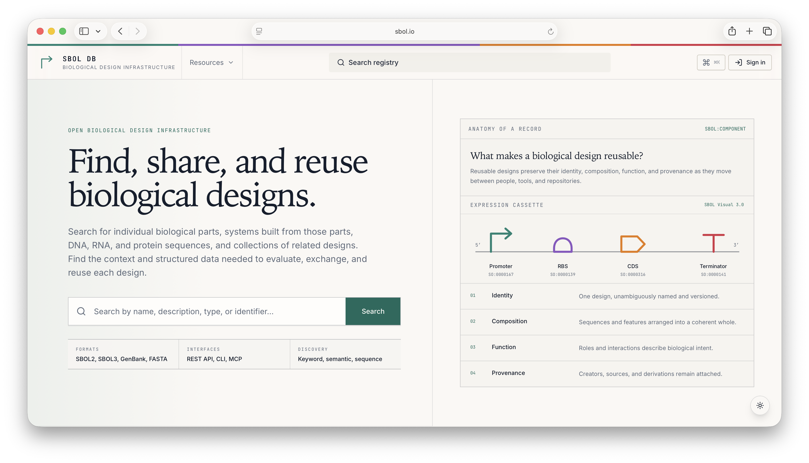
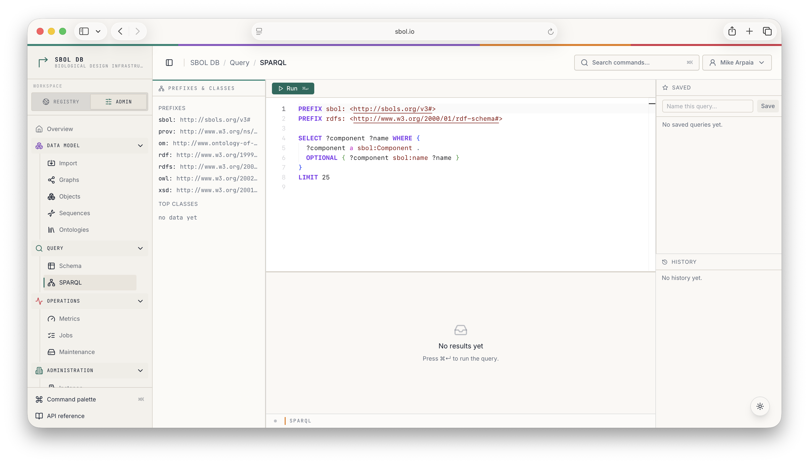
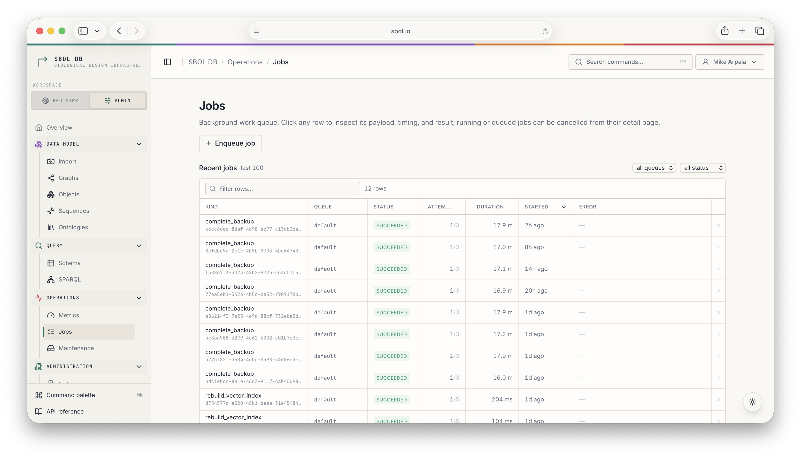
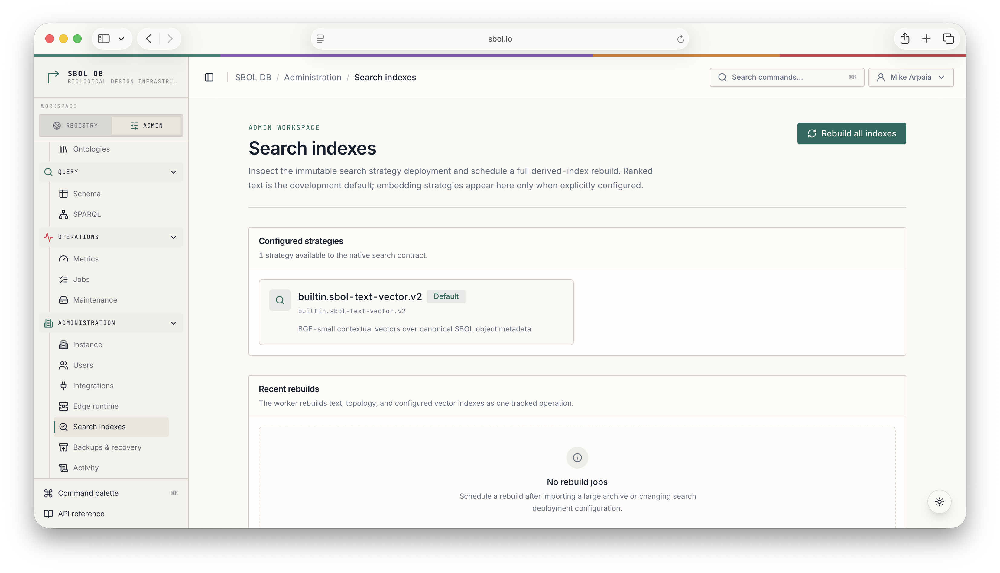
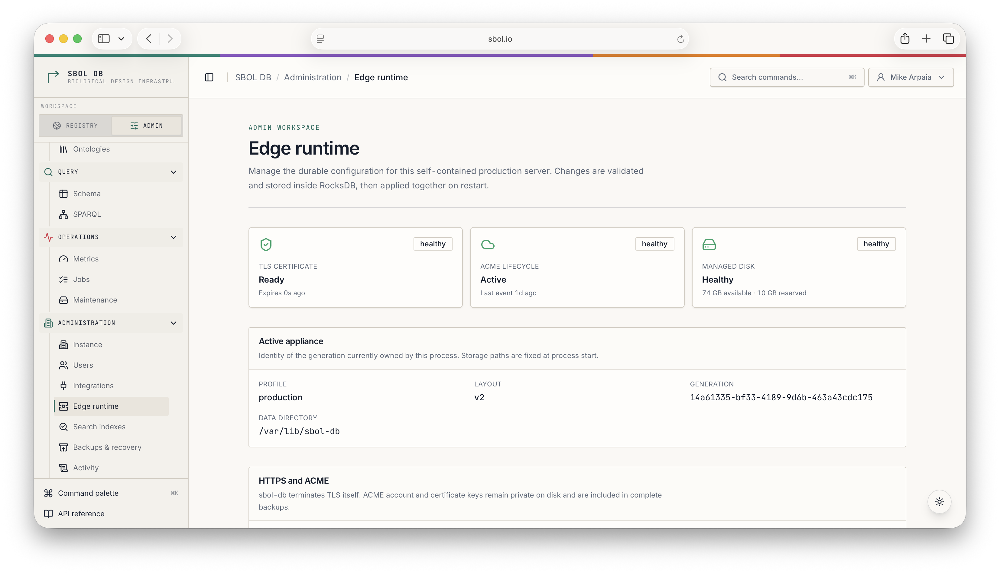
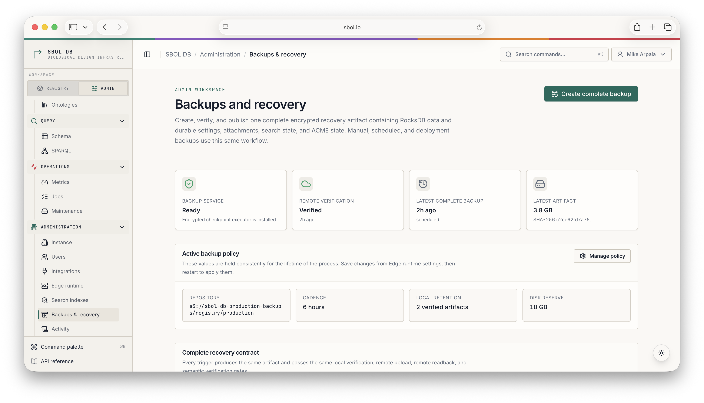

# SBOL DB application and admin UI

SBOL DB ships an embedded React application at `/`, alongside the HTTP APIs.
The public shell supports instance setup, account sessions, and a unified
registry search at `/search`. One search surface exposes faceted design
discovery, nucleotide matching, and every configured structured search index
reported by `GET /api/v2/search/strategies`. The primary choices describe user
intent—names and filters, biological meaning, DNA sequence, or related
designs. Every intent uses one **How this search works** disclosure: it leads
with biological behavior in plain language, then exposes advanced strategy
selection, capability contracts, embedding profiles, candidate sources, and
index names in the same panel. The React component hierarchy mirrors that
single user-facing motif through `HowSearchWorks`. The legacy
`/sequence-search` URL redirects into the DNA-sequence method without losing
its query state. Public object pages
provide typed
identity, provenance, biological relationships,
attachments, similarity, and machine representations. Empty, partial, and
unsupported biological content is called out rather than silently omitted.
Signed-in members use `/workspace` for their owned collections and
`/contribute` for a validate, review, then commit flow. The review names every
minted identity, conversion warning, and collision consequence before any
graph is written. Collection pages reuse the public object frame and expose
owner-gated metadata, membership, publication, and deliberate removal tools.
`/account` provides safe profile and password self-service. `/workspace/shared`
keeps read-only collaborations visibly separate from owned data, while
`/workspace/reviews` collects review requests submitted by or assigned to the
current account. A private object sidebar distinguishes sharing, ownership
transfer, and role-scoped curator review, including its append-only event
history. Password reset is hidden until the instance advertises a configured
delivery capability.
The original **data lab bench** now lives inside its
administrator workspace at `/admin`; bookmarks under `/lab/*` redirect to the
corresponding admin route. Production builds bake the compiled assets into the
binary via `rust-embed`, so deploying the application is the same as deploying any
other route on the server.

Native pages always carry the SBOL DB name and design system. An operator may
set a deployment name, but it appears only as secondary context. Legacy
SynBioHub theme fields remain available to compatibility clients and do not
rename or recolor the native UI.

The shared visual identity is specified in the
[SBOL DB Design Ledger](design-ledger.md). The public registry uses a warm
record-ledger treatment, the administrator workspace presents a compact
registry instrument, and both Scalar API references carry the same signature
mark and semantic SBOL palette.

The public object route consumes `GET /api/v2/objects/{iri}/details`; it does
not interpret raw RDF predicates in React. The details resource owns ACL-aware
graph selection, inverse relationships, provenance, and availability states in
the application layer. Direct SBOL 2, SBOL 3, non-recursive SBOL, GenBank,
FASTA, GFF3, and OMEX links remain ordinary machine requests and are never
claimed by the page dispatcher.

## A tour of the product

The public registry leads with the thing SBOL DB exists to enable: finding,
sharing, and reusing biological designs. Search spans names, descriptions,
types, identifiers, biological meaning, sequence, and configured related-design
strategies. Canonical record pages preserve the identity, composition,
function, and provenance needed to evaluate and exchange a result.

<p align="center">
  
</p>

The administrator workspace fans out into data-model, query, operations, and
administration sections. Its SPARQL editor pairs a prefix and class sidebar with
saved queries, history, and a results grid:

<p align="center">
  
</p>

Durable background work is visible rather than hidden behind the API. The Jobs
view filters recent work by queue and status, while each detail page exposes
payload, attempts, timing, result, and safe cancellation controls:

<p align="center">
  
</p>

Embedded RocksDB deployments expose store size, key estimates, column-family
layout, compaction state, and a deliberate compaction action in the Maintenance
view:

<p align="center">
  
</p>

Search indexes are treated as derived, inspectable infrastructure. Operators
can see the immutable strategy deployment and schedule one tracked rebuild of
text, topology, and configured vector indexes:

<p align="center">
  
</p>

Instance settings control registry identity, the public origin, newly minted
object identifiers, front-page context, and access policy without allowing
deployment branding to replace the SBOL DB product identity:

<p align="center">
  
</p>

The self-contained production profile adds a managed edge runtime. Its admin
view reports the active generation, native TLS and ACME lifecycle, disk reserve,
and pending settings that take effect together after restart:

<p align="center">
  
</p>

Backups & recovery closes the operational loop. Manual, scheduled, and
pre-deployment requests all create the same encrypted complete artifact;
success requires local verification, object-store upload, remote readback, and
semantic verification of the downloaded copy. Restore and rollback remain
offline operations so recovery credentials never enter the browser or running
server.

<p align="center">
  
</p>

These pages share `AdminPage`, `AdminSection`, form, feedback, and
deliberate-confirmation compositions built from the same ShadCN/Radix and
Tailwind primitives as the public application; route code orchestrates typed
queries rather than inventing a second component system. The command palette
and API reference remain available from every admin route.

The application is fronted by these controls:

- `SBOL_DB_LAB_ENABLED` (env, default `true`) — runtime asset/admin toggle.
  When `false`, root portal pages, `/admin`, `/lab`, and `/lab/api` are not
  mounted; non-UI APIs are unaffected.
- `SBOL_DB_PORTAL_ENABLED` (env, default `true`) — runtime toggle for the
  compatibility-aware root portal dispatcher. It serves explicit browser
  navigation (`Accept: text/html`) for known page routes while leaving V1
  JSON/RDF/download requests on their existing handlers. When false, public
  registry pages are disabled, while `/admin`, its login/setup entry points,
  API behavior, and the transitional `/lab` mount remain.
- `SBOL_DB_SESSION_COOKIE_SECURE` (env, default `false`) — adds `Secure` to
  the shared HttpOnly browser-session cookie. Leave it off only for plain-HTTP
  local development; enable it for deployments with an HTTPS public origin.
- `SBOL_DB_ADMIN_API_AUTH_REQUIRED` (env, default `true`) — requires an
  authenticated administrator, by bearer token or same-origin session cookie,
  for every `/lab/api/*` data, query, and operations endpoint. Disabling this
  exposes the SQL console and operational data and is unsuitable for a public
  deployment.
- `--no-default-features` on `sbol-db-server` (cargo, default on) —
  compile-time strip. Removes the `sbol-db-ui` dependency entirely;
  the binary ships without the embedded assets.

The native `/api/v2/admin/*` control plane is always administrator-gated; the
legacy workbench override applies only to `/lab/api/*` and cannot weaken the
native policy. The UI uses the native control plane for instance policy, users,
integrations, search maintenance, jobs, ontologies, complete-backup operations,
and audit.
In the self-contained production profile, Edge runtime persists validated
pending settings and Backups & recovery operates the unified encrypted
RocksDB/blob/search/ACME artifact. Object-store credentials and the private age
recovery identity are never browser-managed, and restore activation remains an
offline command while the server is stopped.

## Development

Two terminals: the Rust server provides the JSON API on port 8888, and the Vite
dev server provides the UI with hot module reload on port 5173. Its dispatch
proxy mirrors the server's browser-versus-machine boundary, so overlapping
compatibility paths still talk to the real backend while page navigation stays
in React Router.

```sh
# Terminal 1 — Rust server (also serves the embedded UI at :8888/,
# but during dev you'll point your browser at the Vite server below).
cargo run -p sbol-db -- server

# Terminal 2 — Vite dev server with React Refresh.
cd crates/sbol-db-ui/ui
pnpm dev
```

Then open `http://localhost:5173/`. Saves to any `.tsx`, `.ts`, or
`.css` file under `crates/sbol-db-ui/ui/src/` update the browser
instantly.

### First-time setup

The `cargo build` invocation that compiles `sbol-db-ui` will run
`npm ci` automatically on first build (or after a clean), via the
crate's `build.rs`. You don't need to install npm dependencies by
hand — Cargo drives the whole pipeline. The only prerequisite is
Node.js 20 or newer on `PATH`.

If you'd rather run the npm install yourself (e.g. to pick up a fresh
`package-lock.json` before a `cargo build`), the command is the same
one the build script uses:

```sh
cd crates/sbol-db-ui/ui
npm ci
```

### macOS SDK path override

If `cargo build` fails on macOS with `'sys/types.h' file not found`
from `pg_query`, your macOS SDK lives somewhere other than the
default Xcode path that `.cargo/config.toml` assumes (e.g. Command
Line Tools only, or a non-default Xcode install). Override at the
shell level:

```sh
export BINDGEN_EXTRA_CLANG_ARGS="-isysroot $(xcrun --show-sdk-path)"
```

### Production-shape testing

To exercise the binary-embedded path — the same code path that ships
in a container image — skip the Vite dev server and visit the Rust
server directly:

```sh
cargo run -p sbol-db -- server
# open http://localhost:8888/
```

This is what users see. The Vite dev server is purely a development
convenience; the binary at `localhost:8888/` serves the same
compiled assets that ship to production.

### Useful UI scripts

All run from `crates/sbol-db-ui/ui/`:

| Command          | Purpose                                                                            |
| ---------------- | ---------------------------------------------------------------------------------- |
| `pnpm dev`       | Vite dev server on `:5173` with HMR.                                               |
| `pnpm build`     | Production build. Normally driven by Cargo; useful manually for output inspection. |
| `pnpm lint`      | ESLint over `src/`.                                                                |
| `pnpm test`      | URL-state and presentation-contract tests.                                         |
| `pnpm typecheck` | `tsc --noEmit` over the project.                                                   |
| `pnpm format`    | Prettier write.                                                                    |

### Opt-outs and edge cases

- **No Node installed?** The `cargo build` still succeeds. `build.rs`
  emits a `cargo:warning=` and embeds a stub HTML page explaining
  how to rebuild. Browser navigation at `/` and `/lab` returns the 503 stub.
- **Want a Rust-only build (CI, cross-compile, air-gapped)?** Set
  `SBOL_DB_SKIP_UI_BUILD=1` in the build environment; `build.rs`
  becomes a no-op and the stub page is embedded instead.
- **Want to disable every embedded UI surface at runtime?** Set
  `SBOL_DB_LAB_ENABLED=false` before `sbol-db server`. Root portal pages,
  `/admin`, `/lab`, and `/lab/api` are not mounted; non-UI APIs are unaffected.
