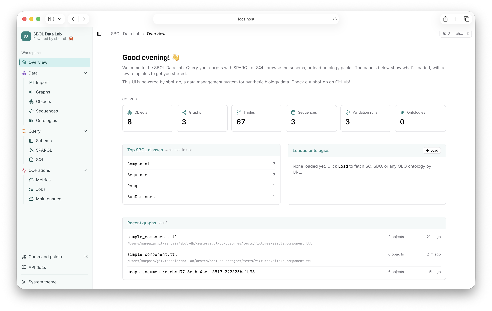
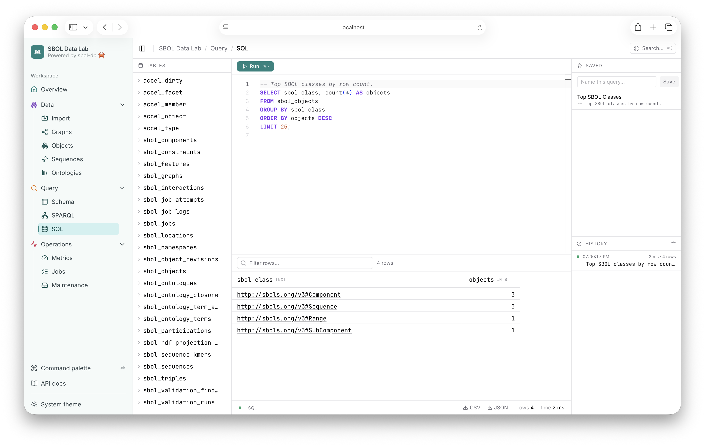
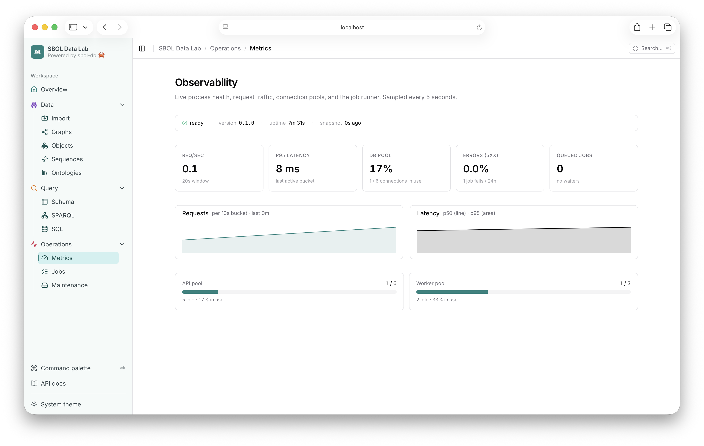
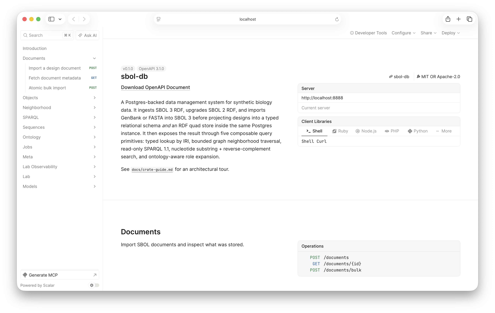

# SBOL DB application and admin UI

SBOL DB ships an embedded React application at `/`, alongside the HTTP APIs.
The public shell supports instance setup, account sessions, registry search,
and object discovery. The original **data lab bench** now lives inside its
administrator workspace at `/admin`; bookmarks under `/lab/*` redirect to the
corresponding admin route. Production builds bake the compiled assets into the
binary via `rust-embed`, so deploying the application is the same as deploying any
other route on the server.

Native pages always carry the SBOL DB name and design system. An operator may
set a deployment name, but it appears only as secondary context. Legacy
SynBioHub theme fields remain available to compatibility clients and do not
rename or recolor the native UI.

## A tour of the admin workspace

The UI opens on an Overview and fans out into data, query, and
operations views from the left nav.

The Overview lands on corpus totals, the most common SBOL classes,
loaded ontologies, and your most recent graphs:

<p align="center">
  
</p>

The SPARQL editor pairs a prefix and class sidebar with a results grid,
saved queries, and history:

<p align="center">
  
</p>

The SQL editor runs against the relational projection, with the full
table list one click away:

<p align="center">
  
</p>

Operations > Metrics is a live observability view: request rate, p95
latency, connection pools, and the job runner, sampled every few
seconds:

<p align="center">
  
</p>

The API docs link opens the Scalar-rendered OpenAPI reference served at
`/docs`, with ready-to-run client snippets:

<p align="center">
  
</p>

The lab is fronted by three knobs:

- `SBOL_DB_LAB_ENABLED` (env, default `true`) — runtime asset/admin toggle.
  When `false`, root portal pages, `/admin`, `/lab`, and `/lab/api` are not
  mounted; non-UI APIs are unaffected.
- `SBOL_DB_PORTAL_ENABLED` (env, default `true`) — runtime toggle for the
  compatibility-aware root portal dispatcher. It serves explicit browser
  navigation (`Accept: text/html`) for known page routes while leaving V1
  JSON/RDF/download requests on their existing handlers. When false, public
  registry pages are disabled, while `/admin`, its login/setup entry points,
  API behavior, and the transitional `/lab` mount remain.
- `SBOL_DB_SESSION_COOKIE_SECURE` (env, default `false`) — adds `Secure` to
  the shared HttpOnly browser-session cookie. Leave it off only for plain-HTTP
  local development; enable it for deployments with an HTTPS public origin.
- `SBOL_DB_ADMIN_API_AUTH_REQUIRED` (env, default `true`) — requires an
  authenticated administrator, by bearer token or same-origin session cookie,
  for every `/lab/api/*` data, query, and operations endpoint. Disabling this
  exposes the SQL console and operational data and is unsuitable for a public
  deployment.
- `--no-default-features` on `sbol-db-server` (cargo, default on) —
  compile-time strip. Removes the `sbol-db-ui` dependency entirely;
  the binary ships without the embedded assets.

## Development

Two terminals: the Rust server provides the JSON API on port 8888, and the Vite
dev server provides the UI with hot module reload on port 5173. Its dispatch
proxy mirrors the server's browser-versus-machine boundary, so overlapping
compatibility paths still talk to the real backend while page navigation stays
in React Router.

```sh
# Terminal 1 — Rust server (also serves the embedded UI at :8888/,
# but during dev you'll point your browser at the Vite server below).
cargo run -p sbol-db -- server

# Terminal 2 — Vite dev server with React Refresh.
cd crates/sbol-db-ui/ui
npm run dev
```

Then open `http://localhost:5173/`. Saves to any `.tsx`, `.ts`, or
`.css` file under `crates/sbol-db-ui/ui/src/` update the browser
instantly.

### First-time setup

The `cargo build` invocation that compiles `sbol-db-ui` will run
`npm ci` automatically on first build (or after a clean), via the
crate's `build.rs`. You don't need to install npm dependencies by
hand — Cargo drives the whole pipeline. The only prerequisite is
Node.js 20 or newer on `PATH`.

If you'd rather run the npm install yourself (e.g. to pick up a fresh
`package-lock.json` before a `cargo build`), the command is the same
one the build script uses:

```sh
cd crates/sbol-db-ui/ui
npm ci
```

### macOS SDK path override

If `cargo build` fails on macOS with `'sys/types.h' file not found`
from `pg_query`, your macOS SDK lives somewhere other than the
default Xcode path that `.cargo/config.toml` assumes (e.g. Command
Line Tools only, or a non-default Xcode install). Override at the
shell level:

```sh
export BINDGEN_EXTRA_CLANG_ARGS="-isysroot $(xcrun --show-sdk-path)"
```

### Production-shape testing

To exercise the binary-embedded path — the same code path that ships
in a container image — skip the Vite dev server and visit the Rust
server directly:

```sh
cargo run -p sbol-db -- server
# open http://localhost:8888/
```

This is what users see. The Vite dev server is purely a development
convenience; the binary at `localhost:8888/` serves the same
compiled assets that ship to production.

### Useful UI scripts

All run from `crates/sbol-db-ui/ui/`:

| Command            | Purpose                                                |
| ------------------ | ------------------------------------------------------ |
| `npm run dev`      | Vite dev server on `:5173` with HMR.                    |
| `npm run build`    | Production build. Normally driven by Cargo; useful manually for output inspection. |
| `npm run lint`     | ESLint over `src/`.                                     |
| `npm run typecheck`| `tsc -b --noEmit` over the project.                     |
| `npm run format`   | Prettier write.                                         |

### Opt-outs and edge cases

- **No Node installed?** The `cargo build` still succeeds. `build.rs`
  emits a `cargo:warning=` and embeds a stub HTML page explaining
  how to rebuild. Browser navigation at `/` and `/lab` returns the 503 stub.
- **Want a Rust-only build (CI, cross-compile, air-gapped)?** Set
  `SBOL_DB_SKIP_UI_BUILD=1` in the build environment; `build.rs`
  becomes a no-op and the stub page is embedded instead.
- **Want to disable every embedded UI surface at runtime?** Set
  `SBOL_DB_LAB_ENABLED=false` before `sbol-db server`. Root portal pages,
  `/admin`, `/lab`, and `/lab/api` are not mounted; non-UI APIs are unaffected.
